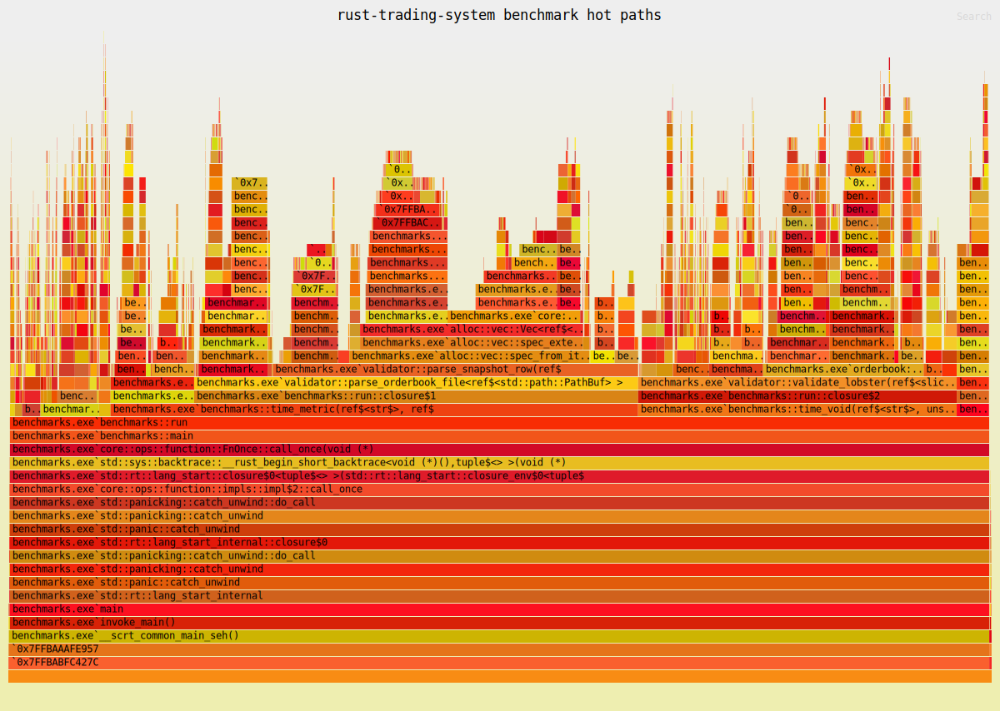

# Performance And Optimization Report

Generated by `cargo run --release -p benchmarks -- --output-file PERFORMANCE.md`.

## Dataset

- Message file: `data/AAPL_2012-06-21_34200000_57600000_message_10.csv`
- Orderbook file: `data/AAPL_2012-06-21_34200000_57600000_orderbook_10.csv`
- Events: `400391`
- Visible depth: `10 levels`
- Validation: `passed`

## Throughput

| Benchmark | Work | Time | Throughput |
| --- | ---: | ---: | ---: |
| message_parse | 400391 events | 0.103 s | 3876313.39 events/s |
| orderbook_parse | 400391 snapshots | 0.563 s | 710604.07 snapshots/s |
| validated_replay | 400391 events | 0.389 s | 1028823.64 events/s |
| synthetic_matching | 100000 orders | 0.011 s | 8894739.65 orders/s |
| latency_scheduler | 50000 orders | 0.006 s | 9082157.19 orders/s |
| strategy_suite | 2000 runs | 0.014 s | 139248.61 runs/s |

## Hot-Path Latency

| Hot path | Samples | p50 | p99 |
| --- | ---: | ---: | ---: |
| lobster_replay_update_plus_snapshot | 50000 | 600 ns | 1.200 us |
| synthetic_matching_process | 50000 | 100 ns | 200 ns |

## Flamegraph

The replay and validation pipeline was profiled using `cargo-flamegraph` to identify hot paths during historical orderbook reconstruction and validation.

Flamegraph profiling showed that the replay validator spends most of its time in orderbook parsing and validation hot paths, with noticeable allocation overhead from repeated Vec growth and temporary structures. These results motivated optimizations such as cache-friendly level layouts, and zero-copy parsing to improve replay throughput and reduce allocation pressure.

## Optimizations Implemented

- Integer tick prices and integer nanosecond timestamps avoid floating-point drift.
- Parser and orderbook CSV vectors are pre-sized from file metadata to reduce reallocations.
- Order ID lookup maps directly to `(side, price)` for cancels, deletes, visible executions, and replaces.
- FOK orders perform a liquidity pre-check before mutating book state.
- Latency simulation uses deterministic fixed-seed sampling and integer packet-loss parts-per-million.
- Strategy analytics use const-generic fixed-size metric series for bounded memory behavior.

## Optimization Roadmap

- Replace `BTreeMap<Price, VecDeque<Order>>` hot paths with arena-backed order storage plus intrusive FIFO links.
- Maintain cached best bid/ask level handles for O(1) best-price reads in synthetic matching.
- Add a dense tick-array book for bounded-price instruments and compare against the tree book.
- Add memory-mapped fixed-schema parsing for LOBSTER rows.
- Add allocation counters and flamegraph captures for replay and matching binaries.
- Run release benchmarks on a pinned CPU core with turbo/power-state notes for reproducibility.
